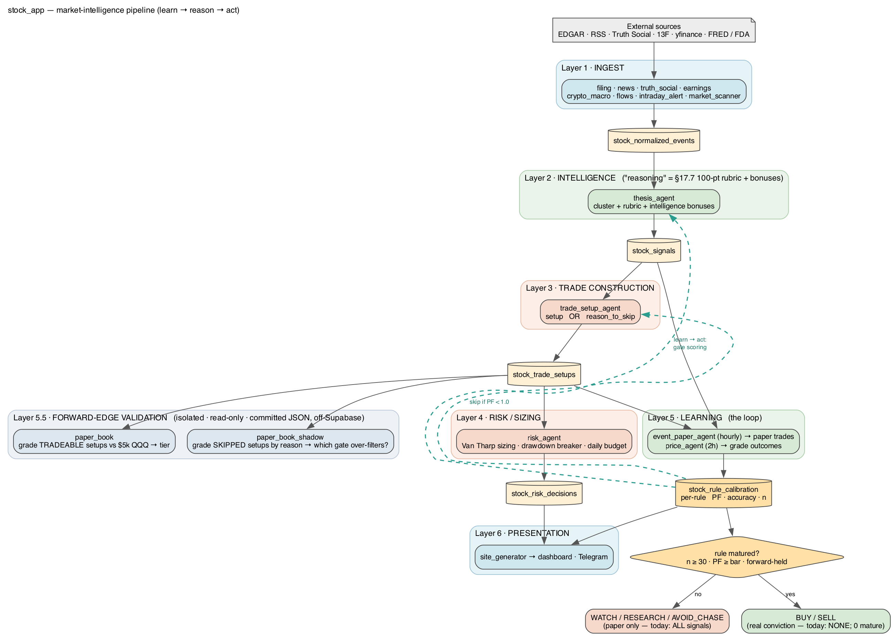

# Architecture

One-page view of the `stock_app` pipeline: six isolated layers, the **learn → act**
feedback loop, and the **forward-edge validation** harness.

> Source: [`architecture.dot`](architecture.dot) — regenerate with
> `dot -Tpng -Gdpi=140 docs/architecture.dot -o docs/architecture.png`
> (or `-Tsvg` → [`architecture.svg`](architecture.svg)). Palette is the project pastel set
> (sky-blue / sage / coral / amber / slate — no purple).

## The pipeline (top to bottom)

Each layer reads only from the layers below it and writes only its own output table, so a
bug in one layer cannot corrupt the layers above.

| Layer | Does | Output |
|---|---|---|
| **1 · Ingest** | EDGAR / RSS / Truth Social / 13F / yfinance → normalized events | `stock_normalized_events` |
| **2 · Intelligence** | `thesis_agent` clusters events + scores them with the §17.7 100-point rubric + intelligence bonuses. *(This is the "reasoning" today — structured scoring, not an LLM.)* | `stock_signals` |
| **3 · Trade construction** | `trade_setup_agent` turns each signal into a tradable setup **or** records a `reason_to_skip` | `stock_trade_setups` |
| **4 · Risk / sizing** | `risk_agent` — Van Tharp sizing, drawdown circuit-breaker, daily budget (paper only) | `stock_risk_decisions` |
| **5 · Learning** | `event_paper_agent` opens paper trades hourly into `stock_event_paper_trades`; `price_agent` grades outcomes every 2h → updates per-rule profit-factor / accuracy / n | `stock_event_paper_trades`, `stock_rule_calibration` |
| **6 · Presentation** | `site_generator` → dashboard + Telegram | hub4apps.com |

## The learn → act loop (the dashed teal edges)

This is what makes it a *learning* system rather than a static scorer:

1. Events become **paper trades** (Layer 5).
2. `price_agent` **grades the outcomes** and updates each rule's calibrated
   profit-factor / accuracy / n.
3. That calibration **feeds back up**: it gates Layer 2 scoring and tells Layer 3 to
   **skip any rule whose PF < 1.0** ("no payoff edge").

So the system doesn't just record — it *changes its behavior from realized outcomes*.
The clearest proof: in June 2026 the grader was made honest (count the declared stop
instead of holding naked to the horizon), and the one rule that looked mature
(`8k_material_event::h30d`) **lost its maturity** — its profit-factor fell from 2.45 to
~2.0 and the new effective-`n` gate dropped it below the **maturity bar** (the strict
graduation bar — *not* the `PF < 1.0` skip bar below; the two thresholds are distinct), so
it reverted to paper and the pipeline stopped proposing it. It talked itself *down* rather
than trade a fake edge.

## The maturity gate (paper → conviction)

The bottom of the diagram. **Two different thresholds matter — do not blur them:**

- **Layer 3 tradeable bar (`PF < 1.0` → skip):** if a rule's calibrated profit-factor is
  below 1.0, `trade_setup_agent` refuses to build a setup at all (`reason_to_skip = "no
  payoff edge"`). This is why there are currently **0 tradeable setups**.
- **Maturity bar (graduate to BUY/SELL):** a *far* stricter, payoff-aware gate — effective
  sample size **n ≥ 30** (collapsed so correlated same-day trades can't inflate it) **and**
  profit-factor at/above the maturity bar (well above 1.0 — ~2.0 in practice) **and** the
  edge must **hold forward**. "Holds forward" today means a human reading the
  forward-validation reports (`paper_book` / `paper_book_shadow`) — it is **not yet an
  automated edge** wired into the gate.

The pipeline emits **WATCH / RESEARCH / AVOID_CHASE** (paper only) until a rule clears the
maturity bar; only then does it graduate to **BUY / SELL**. As of 2026-06, **0 rules are
mature** on honest evidence, so everything is paper — by design: the gate refuses to
license conviction it hasn't earned.

## Layer 5.5 · Forward-edge validation (added 2026-06)

Two **isolated, read-only** validators (they never write Supabase; they commit JSON to the
repo) answer the binding question — *does an edge exist forward?*

- **`paper_book`** — grades the *tradeable* setups forward as a $5k book vs a $5k QQQ
  buy-and-hold, with a staggered tier (continue / inconclusive / fail → edge → conviction).
  Currently starved (0 tradeable setups → honest `inconclusive`).
- **`paper_book_shadow`** — grades the *skipped* setups, per-setup and capacity-free,
  stratified by skip-reason (payoff / vocabulary / instrument) → tells you **which gate
  over-filters real edge**, and flags instrument-gate anomalies (e.g. CVX/Chevron flagged
  untradeable despite being liquid).

Design docs: [`design/2026-06-26-paper-book-forward-edge.md`](design/2026-06-26-paper-book-forward-edge.md),
[`design/2026-06-27-paper-book-shadow-skipped.md`](design/2026-06-27-paper-book-shadow-skipped.md).
