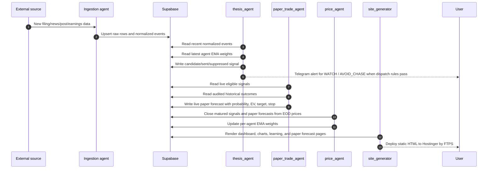
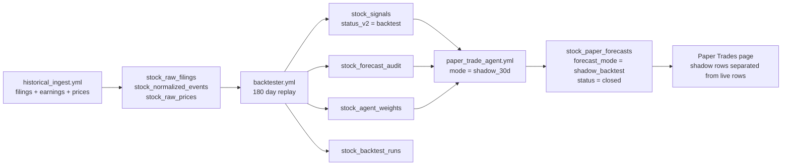
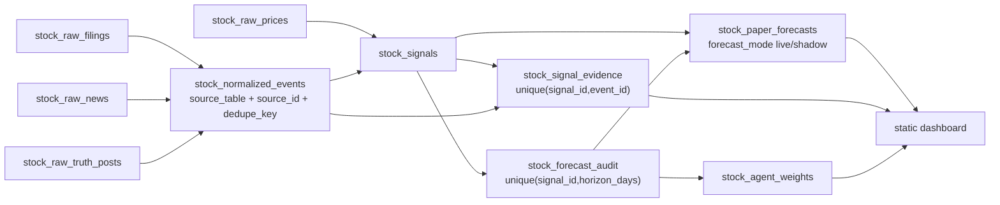

# Technical Architecture

Current as of 2026-05-06. This system is a paper-only market intelligence
pipeline. It does not place trades and does not use BUY/SELL language.

## Runtime Topology

```mermaid
flowchart TB
  subgraph Sources["External Sources"]
    EDGAR["SEC EDGAR submissions"]
    News["CNBC / MarketWatch / Seeking Alpha RSS"]
    Truth["Truth Social RSS"]
    Yahoo["yfinance prices + earnings"]
    Crypto["yfinance BTC / ETH"]
  end

  subgraph Actions["GitHub Actions"]
    Filing["filing_agent<br/>every 5 min"]
    NewsAgent["news_agent<br/>every 5 min"]
    TruthAgent["truth_social_agent<br/>every 5 min"]
    Earnings["earnings_agent<br/>weekly Sun 12:00 UTC"]
    Thesis["thesis_agent<br/>every 5 min<br/>180 min freshness window"]
    EventPaper["event_paper_agent<br/>hourly"]
    Paper["paper_trade_agent<br/>every 15 min live<br/>manual shadow_30d replay"]
    Price["price_agent<br/>weekday EOD"]
    Scanner["market_scanner_agent<br/>weekday EOD"]
    CryptoAgent["crypto_macro_agent<br/>weekday EOD"]
    Flows["flows_agent<br/>weekly Sun 14:00 UTC"]
    ArchiveAgent["archive_agent<br/>weekly Sun 03:00 UTC<br/>(Phase 9 — planned)"]
    Backtester["backtester<br/>manual only"]
    Site["site_generator<br/>every 15 min"]
    SourceReview["source_review_agent<br/>monthly"]
  end

  subgraph Supabase["Supabase Free (active tier)"]
    RawFilings["stock_raw_filings"]
    RawPrices["stock_raw_prices"]
    Events["stock_normalized_events"]
    Signals["stock_signals"]
    Evidence["stock_signal_evidence"]
    Audit["stock_forecast_audit"]
    Weights["stock_agent_weights"]
    PaperForecasts["stock_paper_forecasts"]
    EventPaperTrades["stock_event_paper_trades"]
    Calibration["stock_rule_calibration"]
    Observations["stock_event_outcome_observations"]
    Holdings["stock_institutional_holdings_snapshot"]
    Keywords["stock_keyword_rules"]
    BacktestRuns["stock_backtest_runs"]
    Ops["stock_job_runs<br/>stock_dead_letter_events<br/>stock_agent_freshness"]
  end

  subgraph HostingerTier["Hostinger 25 GB (passive tier + dashboard)"]
    StaticSite["hub4apps.com/stock_app<br/>static dashboard"]
    ArchiveStore["hub4apps.com/stock_app/archive/<br/>JSONL.gz + index.json<br/>(Phase 9 — planned)"]
  end

  Telegram["Telegram alerts"]

  EDGAR --> Filing --> RawFilings --> Events
  News --> NewsAgent --> Events
  Truth --> TruthAgent --> Events
  Yahoo --> Earnings --> Events
  Yahoo --> Price
  Yahoo --> Backtester
  Yahoo --> RawPrices
  Crypto --> CryptoAgent --> Events

  Keywords --> NewsAgent
  Keywords --> TruthAgent

  Events --> Thesis --> Signals
  Thesis --> Evidence
  Thesis --> Telegram
  Weights --> Thesis
  Calibration --> Thesis

  Events --> EventPaper --> EventPaperTrades
  RawPrices --> Scanner --> Observations

  Signals --> Paper --> PaperForecasts
  Audit --> Paper
  RawPrices --> Paper

  Signals --> Price --> Audit
  Price --> Weights
  Price --> PaperForecasts
  EventPaperTrades --> Price
  Price --> Calibration

  RawFilings --> Backtester --> Signals
  Backtester --> Audit
  Backtester --> Weights
  Backtester --> BacktestRuns
  RawFilings --> Flows --> Holdings
  Flows --> Events

  SourceReview --> Ops
  Filing --> Ops
  NewsAgent --> Ops
  TruthAgent --> Ops
  Earnings --> Ops
  Thesis --> Ops
  EventPaper --> Ops
  Paper --> Ops
  Price --> Ops
  Scanner --> Ops
  CryptoAgent --> Ops
  Flows --> Ops
  Backtester --> Ops
  Site --> Ops
  ArchiveAgent --> Ops

  Events --> Site
  Signals --> Site
  Audit --> Site
  Weights --> Site
  PaperForecasts --> Site
  BacktestRuns --> Site
  RawPrices --> Site
  EventPaperTrades --> Site
  Calibration --> Site
  Holdings --> Site
  Site --> StaticSite

  Events -.archive on retention.-> ArchiveAgent
  Signals -.archive on retention.-> ArchiveAgent
  RawPrices -.archive on retention.-> ArchiveAgent
  RawFilings -.archive on retention.-> ArchiveAgent
  EventPaperTrades -.archive on retention.-> ArchiveAgent
  Holdings -.archive on retention.-> ArchiveAgent
  ArchiveAgent --> ArchiveStore
  ArchiveAgent --> Telegram
  ArchiveStore -.calibration merge.-> Price
```

## Live Signal Path

## Historical Learning Path

The `shadow_backtest` mode is intentionally not counted as live paper-trading
performance. It exists to validate the UI, calibration logic, and replay process
using already-audited historical signals. Scheduled `paper_trade_agent` runs stay
strictly live-only.

## Core Tables

| Table | Purpose |
|---|---|
| `stock_watchlists` | Active ticker universe. |
| `stock_symbols` | Symbol metadata, CIK, asset kind. |
| `stock_raw_filings` | EDGAR raw filing metadata. |
| `stock_raw_prices` | Daily OHLCV bars used by charts, chase-risk checks, and paper entries. |
| `stock_normalized_events` | Cross-source event stream consumed by thesis and site. |
| `stock_signals` | Thesis outputs: live signals plus backtest replay signals. `status_v2 IN ('candidate','sent','dispatch_failed')` is the in-flight set; closed/expired/demoted/suppressed/backtest archive on retention. |
| `stock_signal_evidence` | Links signals back to supporting normalized events. |
| `stock_forecast_audit` | Realized outcomes for matured live/backtest signals. One row per `(signal_id, horizon_days)` after `sql/0010`. |
| `stock_agent_weights` | Per-agent EMA accuracy and scoring weight. |
| `stock_paper_forecasts` | Probability-calibrated paper forecasts, split by `forecast_mode`. |
| `stock_event_paper_trades` | Phase 7 closed learning loop. One paper trade per severity≥2 event × horizon (sql/0014, multi-horizon since sql/0018). Reconciled by `price_agent` at horizon close. |
| `stock_rule_calibration` | Per-rule paper-trade accuracy, sample size, mean realized return. Maturity gate (≥90% accuracy, n≥30) graduates a rule from WATCH/AVOID_CHASE to BUY/SELL. |
| `stock_event_outcome_observations` | `market_scanner_agent` per-day per-ticker (move %, prior event) rows for future scoring calibration. |
| `stock_institutional_holdings_snapshot` | `flows_agent` per-quarter 13F-HR snapshot. Diff vs prior quarter generates institutional events. |
| `stock_keyword_rules` | DB-editable keyword routing for `news_agent` and `truth_social_agent`. |
| `stock_backtest_runs` | Backtest metrics and calibration summaries. |
| `stock_job_runs` | Operational run history per agent. |
| `stock_dead_letter_events` | Failed parses/fetches with redacted diagnostics. |

## Data Lineage Contract

## Forecast Modes

| Mode | Source rows | Status behavior | Counts as live paper trading? |
|---|---|---|---|
| `live` | `stock_signals.status_v2 in (candidate,sent,suppressed)` | Opens when generated, closes through `price_agent` | Yes |
| `shadow_backtest` | Audited backtest signals from recent history | Written already closed from historical audit | No |

## Tiered Storage (Phase 9 — planned, v1 design locked)

Three tiers exist by design to keep cloud spend at $0/mo while supporting
years of training history.

| Tier | Where | Contents | Read/write |
|---|---|---|---|
| Active | Supabase Free (≤500 MB) | Open paper trades, recent events, `stock_rule_calibration`, `stock_agent_weights`, `stock_keyword_rules`, last 90/180 days of high-volume tables | Every-N-min agent reads + writes |
| Passive | Hostinger 25 GB FTPS at `hub4apps.com/stock_app/archive/` | Closed paper trades, prices >180d, filings >180d, holdings >1q, normalized events >90d. Stored as gzipped JSONL with a top-level `archive/index.json` (per-`rule_key` cumulative counts pre-computed at archive time) | Weekly write by `archive_agent`; HTTP read by `price_agent` calibration merge |
| Local (optional) | Mac filesystem via `bin/stock_app_sync.sh` | Mirror of `archive/` for offline DuckDB / pandas analysis | Weekly cron pull |

Per-table retention thresholds are listed in
[`docs/phase9-tiered-storage.md`](phase9-tiered-storage.md). Each table
archives on its natural age column (`created_at` / `exit_at` / `fired_at` /
`ts` / `filed_at`).

**Calibration reads both tiers.** The maturity gate (≥90% accuracy, n≥30)
must count all closed paper trades across all time, not just the active
90-day window. `price_agent` fetches `archive/index.json` once per run,
merges archived cumulative counts into the active `n_observations` /
`n_correct` totals, then applies today's delta. The
`stock_rule_calibration.n_observations` value IS the global running total —
the math behind it draws from both tiers. If the archive is unreachable,
calibration falls back to active-only and the maturity gate pauses one
cycle.

## Operational Runbook

Cold start order:

1. Apply `sql/*.sql` in order. Current head is `sql/0018_intc_ebay_and_horizon_index.sql`; Phase 9 will add `sql/0019_retention_columns.sql`.
2. Run `historical_ingest.yml` with `sections=all`.
3. Run `backtester.yml`.
4. Run `paper_trade_agent.yml` with `mode=shadow_30d`.
5. Run `paper_trade_agent.yml` with `mode=live`.
6. Run `site_generator.yml`.
7. After Phase 9 ships: run `archive_agent.yml` once with `dry_run=true` to validate FTPS write and `archive/index.json` schema before the weekly cron starts purging.

Normal operation:

- Ingestion, thesis, paper forecast, and site generation run on cron.
- `price_agent` closes mature signals and forecasts at weekday EOD.
- `backtester` remains manual-only so historical replay is deliberate.
- `source_review_agent` runs monthly to catch feed drift.

## Current Verification Snapshot

Last verified on 2026-05-02:

- Shadow replay wrote 27 closed `shadow_backtest` paper forecasts before the Phase 7 leakage fix.
- Live paper forecast pass wrote 0 rows because no live eligible signals existed.
- Manual thesis run saw 4 fresh events in the 180-minute window and produced 0 candidates.

## Outcome Contract

Backtest, live audit, and paper forecast closure use the same paper-only outcome
contract:

1. Signal fires on day `D`.
2. Entry is the next available trading session open after `D`.
3. Exit is the close at `entry_session + horizon_days - 1`, or the next available close.
4. Net return subtracts 5 bps per side.
5. `stock_forecast_audit` stores `entry_price`, `exit_price`, `entry_at`, `exit_at`, and `outcome_method='next_session_open_to_horizon_close'`.

Shadow replay calibration filters by audit `computed_at`, not just signal
`fired_at`, so replay days cannot learn from outcomes that were not known yet.
- Site generation succeeded after increasing Hostinger FTPS timeout to 120 seconds.
- Live Paper Trades page rendered `Shadow 30d = 27` and `Shadow Hit Rate = 48%`.
