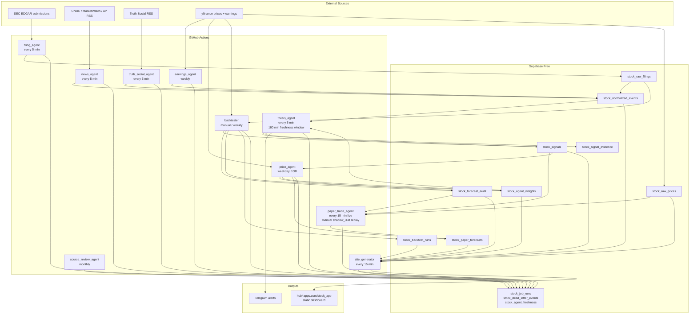
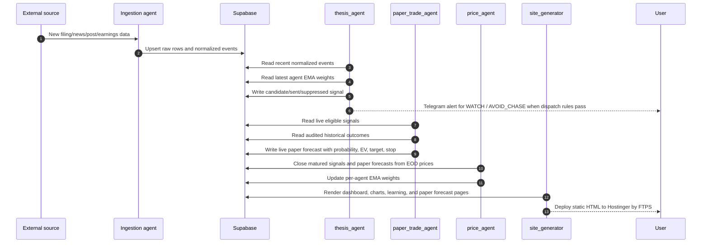
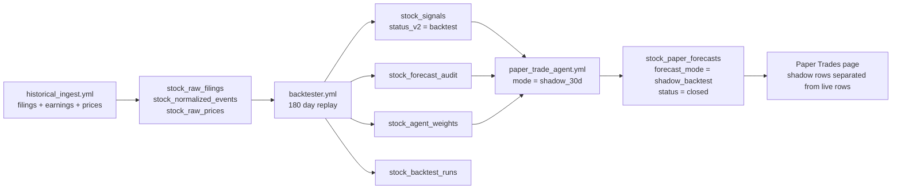

# Technical Architecture

Current as of 2026-05-02. This system is a paper-only market intelligence
pipeline. It does not place trades and does not use BUY/SELL language.

## Runtime Topology

## Live Signal Path

## Historical Learning Path

The `shadow_backtest` mode is intentionally not counted as live paper-trading
performance. It exists to validate the UI, calibration logic, and replay process
using already-audited historical signals. Scheduled `paper_trade_agent` runs stay
strictly live-only.

## Core Tables

| Table | Purpose |
|---|---|
| `stock_watchlists` | Active ticker universe. |
| `stock_symbols` | Symbol metadata, CIK, asset kind. |
| `stock_raw_filings` | EDGAR raw filing metadata. |
| `stock_raw_prices` | Daily OHLCV bars used by charts, chase-risk checks, and paper entries. |
| `stock_normalized_events` | Cross-source event stream consumed by thesis and site. |
| `stock_signals` | Thesis outputs: live signals plus backtest replay signals. |
| `stock_signal_evidence` | Links signals back to supporting normalized events. |
| `stock_forecast_audit` | Realized outcomes for matured live/backtest signals. |
| `stock_agent_weights` | Per-agent EMA accuracy and scoring weight. |
| `stock_paper_forecasts` | Probability-calibrated paper forecasts, split by `forecast_mode`. |
| `stock_backtest_runs` | Backtest metrics and calibration summaries. |
| `stock_job_runs` | Operational run history per agent. |
| `stock_dead_letter_events` | Failed parses/fetches with redacted diagnostics. |

## Forecast Modes

| Mode | Source rows | Status behavior | Counts as live paper trading? |
|---|---|---|---|
| `live` | `stock_signals.status_v2 in (candidate,sent,suppressed)` | Opens when generated, closes through `price_agent` | Yes |
| `shadow_backtest` | Audited backtest signals from recent history | Written already closed from historical audit | No |

## Operational Runbook

Cold start order:

1. Apply `sql/*.sql` in order through `sql/0009_paper_forecast_modes.sql`.
2. Run `historical_ingest.yml` with `sections=all`.
3. Run `backtester.yml`.
4. Run `paper_trade_agent.yml` with `mode=shadow_30d`.
5. Run `paper_trade_agent.yml` with `mode=live`.
6. Run `site_generator.yml`.

Normal operation:

- Ingestion, thesis, paper forecast, and site generation run on cron.
- `price_agent` closes mature signals and forecasts at weekday EOD.
- `backtester` remains manual/weekly so historical replay is deliberate.
- `source_review_agent` runs monthly to catch feed drift.

## Current Verification Snapshot

Last verified on 2026-05-02:

- Shadow replay wrote 27 closed `shadow_backtest` paper forecasts.
- Live paper forecast pass wrote 0 rows because no live eligible signals existed.
- Manual thesis run saw 4 fresh events in the 180-minute window and produced 0 candidates.
- Site generation succeeded after increasing Hostinger FTPS timeout to 120 seconds.
- Live Paper Trades page rendered `Shadow 30d = 27` and `Shadow Hit Rate = 48%`.
