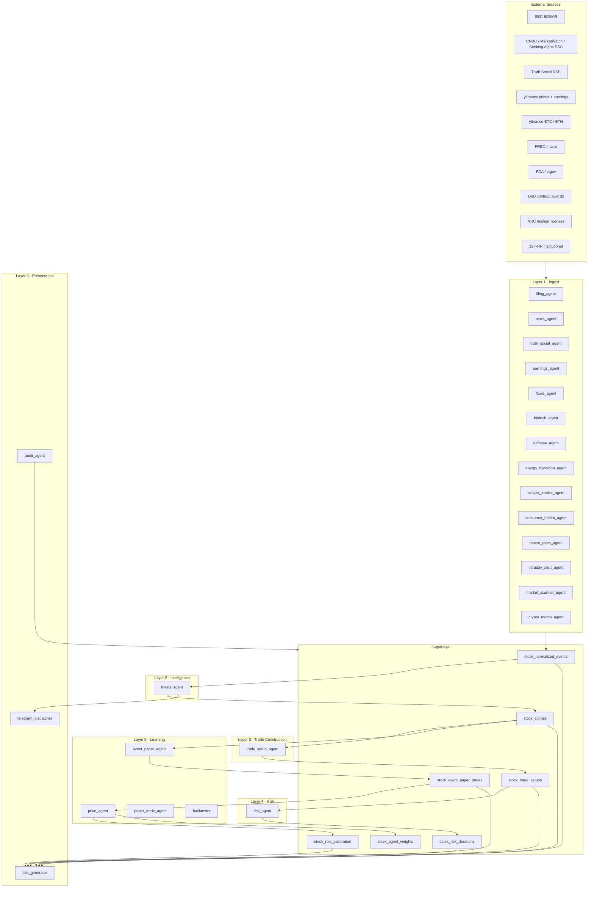
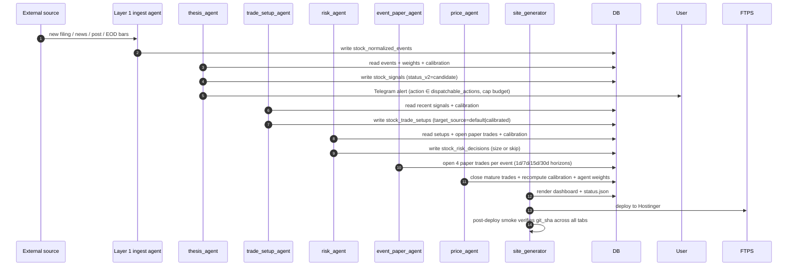
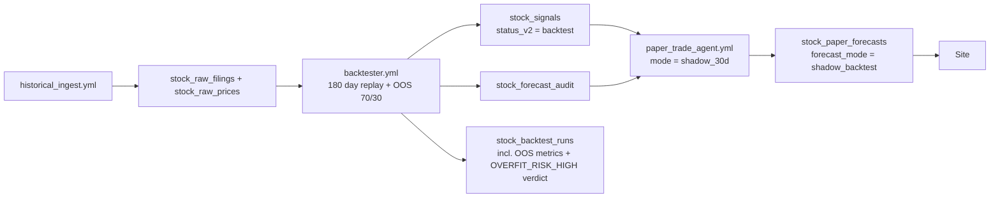

# Technical Architecture

Current as of 2026-05-19 (Phase 11.6 — risk layer + adaptive setup sizing
shipped). This system is a six-layer, paper-by-default market intelligence
pipeline. The maturity gate (≥90% accuracy, n≥30 closed paper trades per
rule) unlocks BUY/SELL vocabulary on a per-rule basis; until then the bot
emits WATCH / RESEARCH / AVOID_CHASE / CHASE_RISK. A second `training`
tier (≥70% accuracy, n≥30) is staged to emit PROVISIONAL_LONG /
PROVISIONAL_SHORT once the dispatcher wiring is complete.

Layer boundaries are strict: each layer reads from layers below and writes
only to its own output table. A bug in trade_setup_agent literally cannot
corrupt stock_signals — the foreign-key direction enforces it.

## Six-Layer Pipeline

```
Layer 1 — INGEST
  in:  EDGAR, RSS, Truth Social, FRED, FDA, ctgov, DoD, NRC, yfinance, 13F-HR
  out: stock_normalized_events
  agents: filing_agent, news_agent, truth_social_agent, earnings_agent,
          crypto_macro_agent, flows_agent, biotech_agent, defense_agent,
          energy_transition_agent, activist_insider_agent,
          consumer_health_agent, macro_rates_agent, intraday_alert_agent,
          market_scanner_agent

Layer 2 — INTELLIGENCE
  in:  stock_normalized_events + stock_rule_calibration + stock_agent_weights
  out: stock_signals (vocabulary-gated by maturity tier; valid_until per signal)
  agent: thesis_agent

Layer 3 — TRADE CONSTRUCTION (Phase 11.6)
  in:  stock_signals
  out: stock_trade_setups (entry style, stop_pct/target_pct, target_source,
       valid_until, confidence, reason_to_skip)
  agent: trade_setup_agent

Layer 4 — RISK / CAPITAL ALLOCATION (Phase 11.6)
  in:  stock_trade_setups + stock_event_paper_trades + stock_rule_calibration
  out: stock_risk_decisions (size or skip, with rules_applied audit trail)
  agent: risk_agent (HARDCODED: Van Tharp sizing, equity-curve drawdown
         breaker, daily risk budget, rule concentration cap, stop sanity)

Layer 5 — LEARNING (empirical calibration, NOT trained ML — see ml-roadmap.md)
  in:  stock_signals + stock_event_paper_trades + stock_raw_prices
  out: stock_rule_calibration, stock_agent_weights
  agents: event_paper_agent (4 horizons per event: 1d/7d/15d/30d),
          price_agent (EOD reconcile + MFE/MAE/target_hit/stop_hit audit),
          paper_trade_agent, backtester
  note: "Learning" here means outcome-based statistical bookkeeping (EMA on
        agent accuracy + per-rule calibration counters + Bayesian shrinkage
        on prob_win), NOT a trained classifier. See `docs/ml-roadmap.md`
        for the four gate criteria that would justify adding real ML.

Layer 6 — PRESENTATION
  in:  everything (read-only)
  out: hub4apps.com/stock_app/{dashboard tabs, status.json}, Telegram
       tabs: Dashboard · Signals · Events · Setups · Risk · Agents ·
             Backtest · Paper Trades · Calibration · Weekly · Learning
             (+ per-ticker chart pages, per-alert detail pages)
  agents: site_generator, telegram_dispatcher

Operations:
  audit_agent (daily integrity check), ops_recorder (workflow lifecycle),
  archive_agent (Phase 9 — tiered storage, partially shipped),
  source_review_agent (monthly feed drift)
```

23 agents total in `agents/AGENT_INVENTORY` (single source of truth — the
dashboard and status.json both read it). Cron orchestration is best-effort:
external `cron-job.org` pingers re-dispatch the seven tightest-cadence
workflows when GHA-native cron drifts more than 7 minutes
(see [`RUNBOOK.md`](RUNBOOK.md) §8). `concurrency: cancel-in-progress`
on each workflow makes the double-dispatch harmless.

## Runtime Topology



## Live Signal Path



## Core Tables

| Layer | Table | Purpose |
|---|---|---|
| L1 | `stock_normalized_events` | Universal event bus. Filter for "what landed recently" via `created_at`; `event_at` is real-world event time. |
| L1 | `stock_raw_filings` / `stock_raw_prices` | Pre-normalized ingest tables. |
| L2 | `stock_signals` | Scored intelligence with `score_breakdown` JSONB, `valid_until` per signal, `weight_at_time` snapshot (incl. `primary_event_subtype` as of A2). |
| L2 | `stock_signal_evidence` | Many-to-many link signal ↔ events. |
| L3 | `stock_trade_setups` | Tradable proposals. Includes `target_source` (default vs calibrated from B1). |
| L4 | `stock_risk_decisions` | One row per setup. `rules_applied` JSONB carries the audit trail; `portfolio_state` snapshots the risk state at decision time. |
| L5 | `stock_event_paper_trades` | 4 paper trades per event × horizon. `realized_return`, `mfe_pct`, `mae_pct`, `target_hit`, `stop_hit`. ON CONFLICT idempotency (B3). |
| L5 | `stock_rule_calibration` | Per-rule accuracy, profit_factor, mean_mfe_pct, mean_mae_pct, target_hit_rate, stop_hit_rate. Maturity gate: ≥90% acc + n≥30. |
| L5 | `stock_agent_weights` | Per-agent EMA weights blended into thesis scoring. |
| L5 | `stock_paper_forecasts` | Probability-calibrated forecasts split by `forecast_mode` (live vs shadow_backtest). |
| L5 | `stock_forecast_audit` | One row per `(signal_id, horizon_days)` after `sql/0010`. |
| L6 | `stock_telegram_dispatch_log` | One row per send attempt with delivery_ok / error / msg_id. |
| Ops | `stock_job_runs` | Per-agent run history; `run_type` ∈ ('agent', 'wrapper') with `parent_run_id` lineage (sql/0022). |
| Ops | `stock_dead_letter_events` | Failed parses with redacted diagnostics. |
| Ops | `stock_agent_freshness` | Last-seen-on-schedule per agent. |
| Ref | `stock_watchlists` | Categorized ticker baskets (core, AI cluster, mutual_funds, small_cap_insider, …). |
| Ref | `stock_symbols` | Symbol metadata with CIK for SEC-tracked names. |
| Ref | `stock_keyword_rules` | DB-editable keyword routing for news / Truth Social. |

The unified `rule_key` format (`event_type:subtype:hNd`) lives in
`agents/_rule_key.py`. Both writers (`event_paper_agent`) and readers
(`trade_setup_agent`, `thesis_agent.cluster_has_mature_rule`) import it
from there — see A2 in the review fixes for the rationale.

## Survival Rules (Layer 4)

Hardcoded module-level constants in `agents/risk_agent.py` — survival
rules must not be relaxable by misconfigured env or DB. Each rule
records pass/fail in `stock_risk_decisions.rules_applied` for audit.

| Rule | Threshold | Source of value |
|---|---|---|
| `setup_self_skip` | reason_to_skip non-empty | propagated from trade_setup |
| `confidence_floor` | `CONFIDENCE_FLOOR = 0.30` | const |
| `drawdown_circuit_breaker` | `MAX_DRAWDOWN_PCT = 0.10` peak-to-trough on 30d equity curve (A1) | const |
| `daily_risk_budget` | `MAX_DAILY_RISK_PCT = 0.03` | const |
| `rule_concentration` | `MAX_SAME_RULE_OPEN = 3` | const |
| `stop_sanity` | `STOP_PCT_MIN = 0.005`, `STOP_PCT_MAX = 0.20` | const |
| `maturity_weight` | production: 1.0×, training: 0.5×, immature: 0.25× | const map |

Position size = `NAV × RISK_PER_TRADE_PCT × maturity_multiplier / stop_pct`
(Van Tharp). Tighter stop → larger size, same dollar risk.

## Historical Learning Path



The `shadow_backtest` mode is intentionally not counted as live paper-trading
performance. The OOS chronological 70/30 split in `backtester.compute_oos_split_metrics`
emits an explicit `OVERFIT_RISK_HIGH` verdict when the OOS slice
underperforms the IS slice by too much — the right discipline against
in-sample-fit illusions.

## Tiered Storage (Phase 9 — partial)

| Tier | Where | Contents |
|---|---|---|
| Active | Supabase Free (≤500 MB) | Open paper trades, recent events, calibration, weights, last 90/180 days of high-volume tables |
| Passive | Hostinger 25 GB at `hub4apps.com/stock_app/archive/` | Closed paper trades, prices >180d, filings >180d, holdings >1q. Gzipped JSONL + per-`rule_key` cumulative `index.json` |
| Local (optional) | Mac via `bin/stock_app_sync.sh` | Mirror for offline analysis |

Calibration reads both tiers — the maturity gate must count all closed
paper trades across all time, not just the active 90-day window.
`price_agent` fetches `archive/index.json` once per run and merges the
cumulative counts. Per-table retention details in
[`docs/phase9-tiered-storage.md`](phase9-tiered-storage.md).

## Operational Runbook

See [`docs/RUNBOOK.md`](RUNBOOK.md) for the canonical operating procedures.
Highlights:

- 7 tightest-cadence workflows have external `cron-job.org` pingers
  staggered off the GHA cron — `concurrency: cancel-in-progress`
  makes the double-dispatch harmless and gives a hard guarantee of
  ≤7-minute drift.
- `site_generator_retry.yml` listens for `site_generator` failures from
  `schedule` / `workflow_run`, sleeps 5 min (FTP recovery), and
  re-dispatches via `workflow_dispatch`. Single-shot to prevent
  cascading.
- `audit_agent.yml` (daily 04:00 UTC) checks five integrity invariants
  and Telegrams on failure.

## Verification Snapshot

Last verified 2026-05-19 with the post-A1/A2/A3 + B1/B2/B3 + C1/C2 + D1-D5
fixes landed:

- `pytest tests/` — 105 green across 7 files
- Drawdown circuit breaker now trips on the correct math (was previously
  the per-trade mean, effectively un-trippable)
- `rule_key` unified in `agents/_rule_key.py`; subtyped calibration now
  reaches `trade_setup_agent` (was silently mismatched)
- Dilution direction routes bearish (was incorrectly bullish on tie)
- `stock_trade_setups` and `stock_risk_decisions` surfaced on dashboard
- `status.json` now carries `git_sha`, `pipeline_version`,
  `agents.inventory_count`, and a per-layer breakdown
- Alert cap UI shows "X / 5 cap used · Y severity-4 bypass" (was
  "-26 remaining")
- Post-deploy smoke confirms every tab carries the same git_sha meta
  → partial FTPS uploads now fail loudly instead of silently producing
  stale tabs
- **Weekly** dashboard tab (added 2026-05-21): 7-day retrospective with
  three sections — performance (win rate, equity curve, best/worst rule
  by net), rule maturity (gap to 90%/n≥30 graduation gate, flags
  direction-inverted rules), signal-to-outcome funnel (events landed →
  signals scored → trades opened → closed → winners). Self-detects
  backfill artifacts and renders a banner when synthetic exits dominate
  the window. Uses `created_at` for funnel throughput, `entry_at` /
  `exit_at` for lifecycle filters (per CLAUDE.md rule #1).

## Outcome Contract

1. Signal fires on day `D`.
2. Entry is the next available trading session open after `D`.
3. Exit is the close at `entry_session + horizon_days`, or the next available close.
4. Net return subtracts 5 bps per side.
5. `stock_event_paper_trades` records `entry_price`, `exit_price`,
   `entry_at`, `exit_at`, `realized_return`, plus MFE/MAE/target_hit/stop_hit
   from the daily-HL audit.
6. Shadow replay calibration filters by audit `computed_at`, not signal
   `fired_at`, so replay days cannot learn from outcomes that were not
   known yet.
